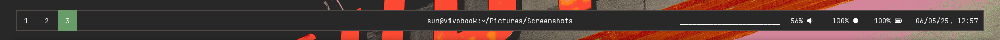
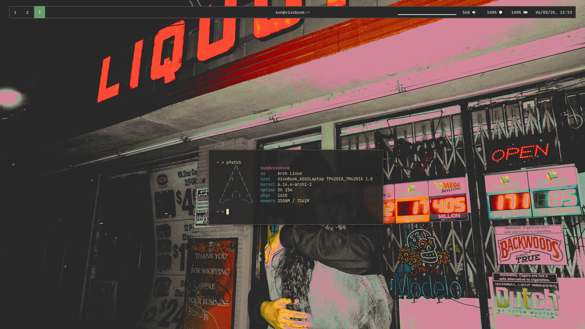
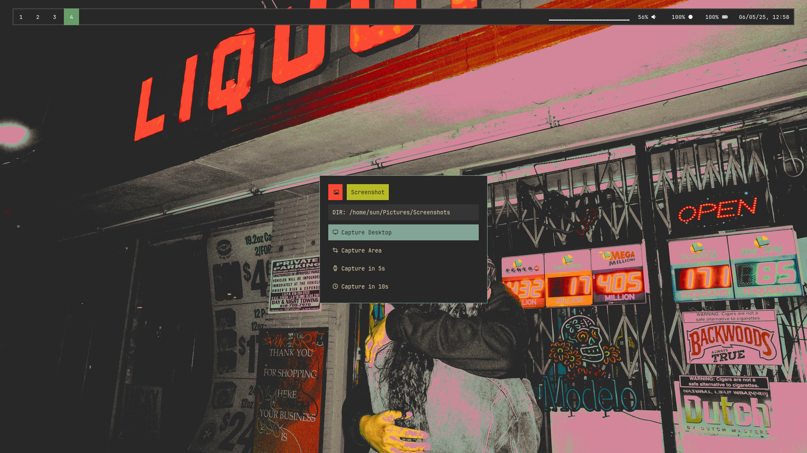

# 🎛️ Dots

🎨 *My dotfiles for* **SwayFX**
 
---

## 📦 Dependencies (Arch Linux)

These are required packages:

- `curl`  
- `git`  
- `swayfx`  
- `waybar-cava` *(AUR)*  
- `cava`  
- `ttf-jetbrains-mono-nerd`  
- `rofi-wayland`  
- `alacritty`  
- `swaypaper`  
- `swww`  
- `grim`  
- `slurp`  
- `wayfreeze` *(AUR)*  
- `waypicker` *(AUR)*  

> ⚠️ **Note:** Package names may differ or be missing on other distributions.

---

## 🚀 Installation

Clone the repository and copy the configuration files:

```bash
git clone https://github.com/thecaprisun/dotfiles
cd dots
cp -r ./config/* ~/.config/
```

> ⚠️ **Warning:** This will **overwrite** your existing configuration files.  
> 💾 Make sure to **back up your current `~/.config/` folder** (*or the interested folders)* before proceeding.

---

## 🔧 Features

- 🧱 Tiling layout via [**swaymonad**](https://github.com/nicolasavru/swaymonad)  
- 🎨 Custom Rofi themes adapted from [**adi1090x**](https://github.com/nicolasavru/swaymonad)
- 📊 Audio visualizer embedded in Waybar via waybar-cava
- 🖍️ On-screen color picking using waypicker
- 📷 Screenshot menu with region, window, and fullscreen capture using grim, slurp, and wayfreeze

---

## 📸 Screenshots





---

## 🗒️ License & Credits

MIT ig.  
Props to all the original creators and theme authors.

